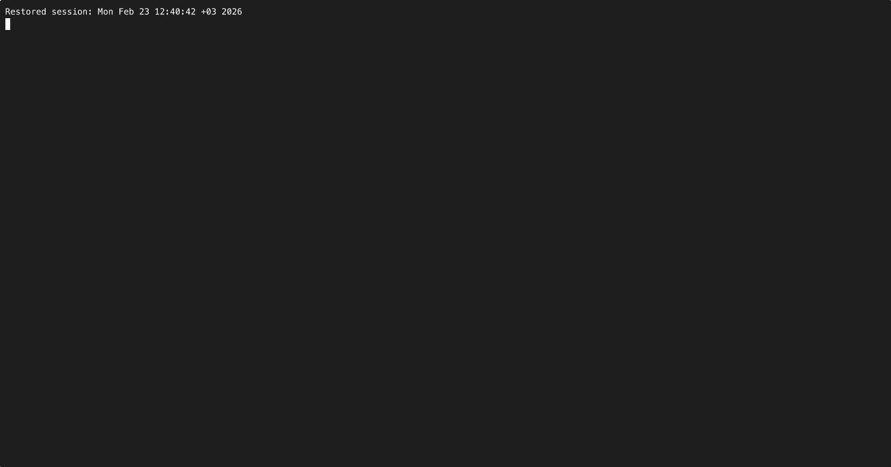

# abp-msx

Lightweight TUI to run and manage [ABP Framework](https://abp.io) microservice solutions from the CLI. Start containers and .NET applications, view logs, and control services from a single terminal.



## Purpose

- **Lightweight** — Single binary, no extra runtime; uses your existing Docker and .NET SDK.
- **ABP-native** — Reads run profiles from `etc/abp-studio/run-profiles/*.abprun.json` (ABP Studio format).
- **CLI-first** — Run from the project root (or with `-d`), pick a profile, then use the TUI to start/stop services and view logs.

## Requirements

- An ABP solution with **ABP Studio** run profiles: directory `etc/abp-studio` and `etc/abp-studio/run-profiles/*.abprun.json`.
- **Go 1.21+** to build.
- **Docker** (for container services) and **.NET SDK** (for .NET applications), as defined in your profile.

## Install

```bash
git clone https://github.com/paynion/abp-msx.git
cd abp-msx
go build -o abp-msx .
# optional: copy to PATH
# cp abp-msx /usr/local/bin/
```

Cross-build (see `Makefile`):

```bash
make all   # builds linux-amd64, linux-arm64, darwin-amd64, darwin-arm64, windows-amd64, windows-arm64 in dist/
```

## Usage

From your ABP solution root (the one that contains `etc/abp-studio`):

```bash
./abp-msx
```

Or from any directory:

```bash
./abp-msx -d /path/to/your/abp-solution
```

- If there is **one** run profile, it is used automatically.
- If there are **several**, you choose one at startup, then the TUI opens.

### TUI shortcuts

| Key | Action |
|-----|--------|
| **↑↓** | Move selection |
| **Enter** | Start / stop selected service (or section) |
| **L** | View logs for selected service |
| **O** | Open service URL in browser |
| **K** | Kill process on service port |
| **F** | Open service folder in file manager |
| **S** | Start all services |
| **X** | Stop all services (and cancel retries) |
| **q** | Quit |

Logs view: **G** or **g** to resume auto-scroll, **q** to go back.

## How it works

1. Finds project root (current dir or `-d`) by looking for `etc/abp-studio`.
2. Discovers run profiles in `etc/abp-studio/run-profiles/*.abprun.json`.
3. Loads the chosen profile and builds the service list (containers + applications from the config).
4. TUI shows groups (e.g. Containers, Applications, Core Services). You start/stop per service, per section, or all.
5. Logs are read from the project’s log directory; container logs come from `docker logs`.